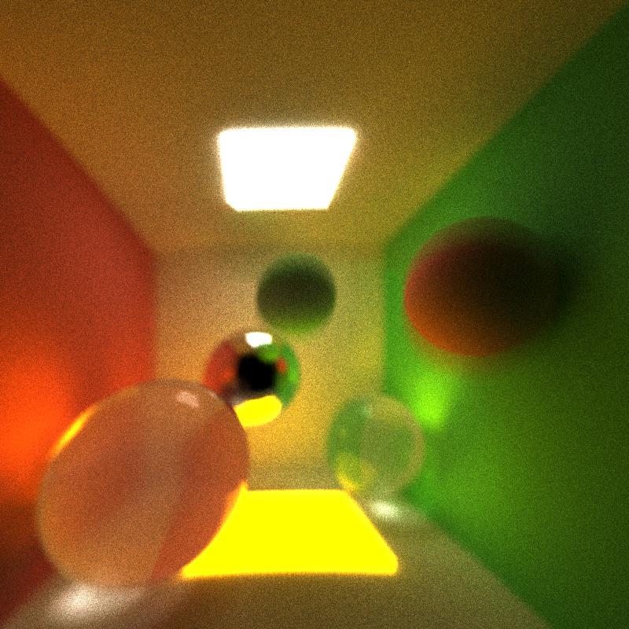
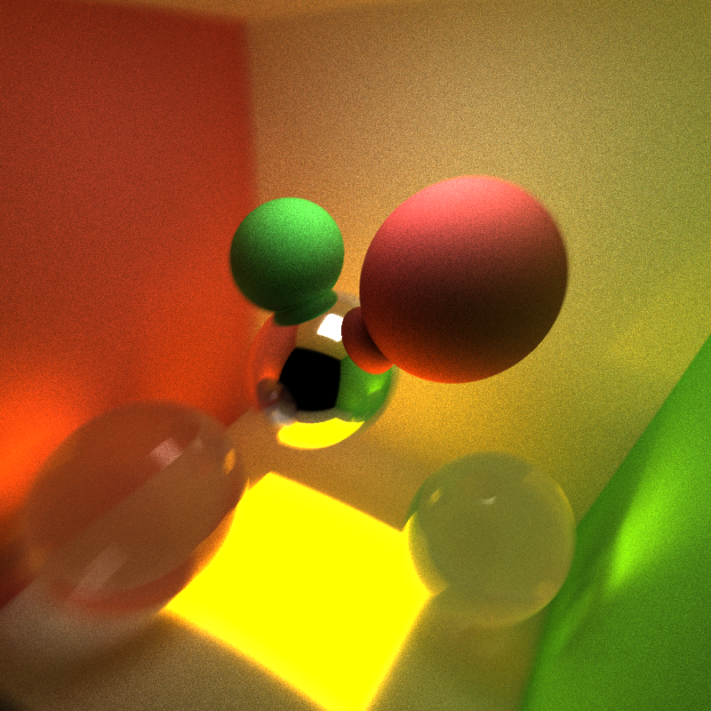
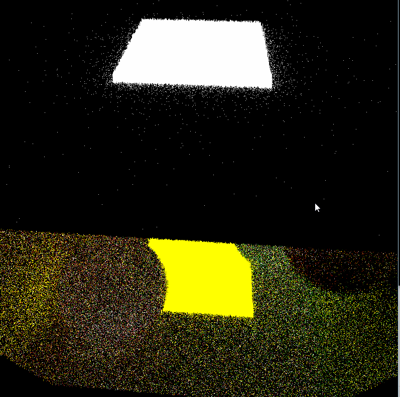
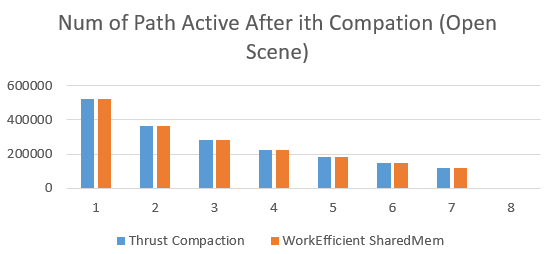
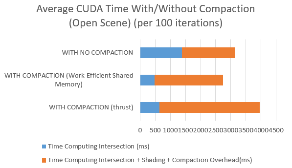
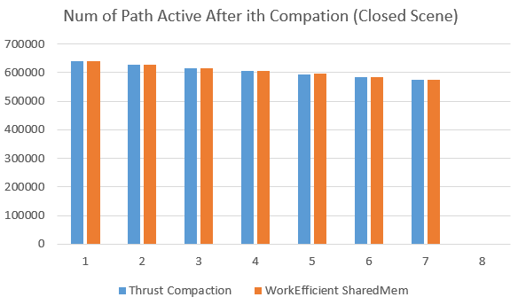
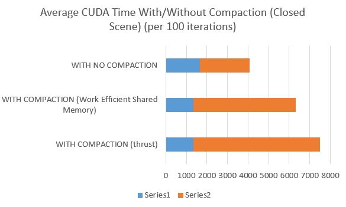
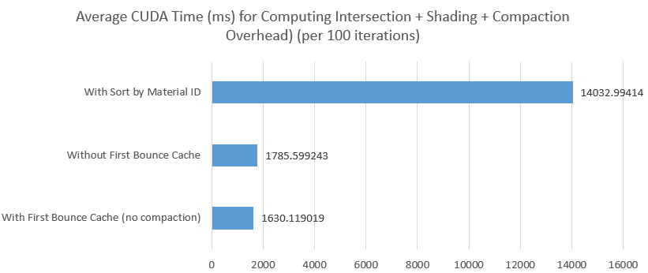

CUDA Path Tracer
================

**University of Pennsylvania, CIS 565: GPU Programming and Architecture, Project 3**

**University of Pennsylvania, CIS 565: GPU Programming and Architecture, Project 2**

* Xiang Deng
* Tested on:  Windows 10-Home, i7-6700U @ 2.6GHz 16GB, GTX 1060 6GB (Personal Computer)

* Features
  * BSDF shading with diffusion, reflection.
  * Stream Compaction for removing inactive rays.
  * Sorting rays by material id.
  * First bounce caching of intersections.

* Additional features
  * Refractions.
  * Anti-aliasing with uniform guassian spherical jitter.
  * Motion blur.
  * Depth of field. 
  
* Motion blur + basic shading features (reflection + diffusion + refraction)

* Static scene rendering + basic shading features (reflection + diffusion + refraction)

* Depth of field

* Anti-aliasing

* Without-anti-aliasing

* Analysis

Stream Compaction reduces the number of active bouncing paths within one iteration, plot below illustrates this in open scene (cornell).
The thrust implementation (removeif) performs similar to the work effcicient shared memory version implementated by the author.

Stream compaction consequently significantly reduces the time consumption on computing spatial intersections of rays on objects; yet overhead of the extra
time spending on compaction itself trememdously decreases its benefit.
In comparison between the two version of compaction, shared memory provides more benefits in terms of both computing intersections and the overall CUDA running time.

In closed scene, Stream Compaction doesn't significantly the number of active bouncing paths within one iteration, plot below illustrates this in closed scene (cornell), in this case very few
rays terminated.
The thrust implementation (removeif) performs similar to the work effcicient shared memory version implementated by the author.

In closed scene, both implementation of compaction causes delay in processing; yet the overhead of the extra
time spending on compaction itself cause further delay. Lights terminated mostly (probably) due to the collision on emissive lights.
In comparison between the two version of compaction, shared memory provides more benefits in terms of both computing intersections and the overall CUDA running time.

Sorting trememdously increases the delay in processing; whereas caching first bouncing does reduces around 10 percent of the total processing time.

