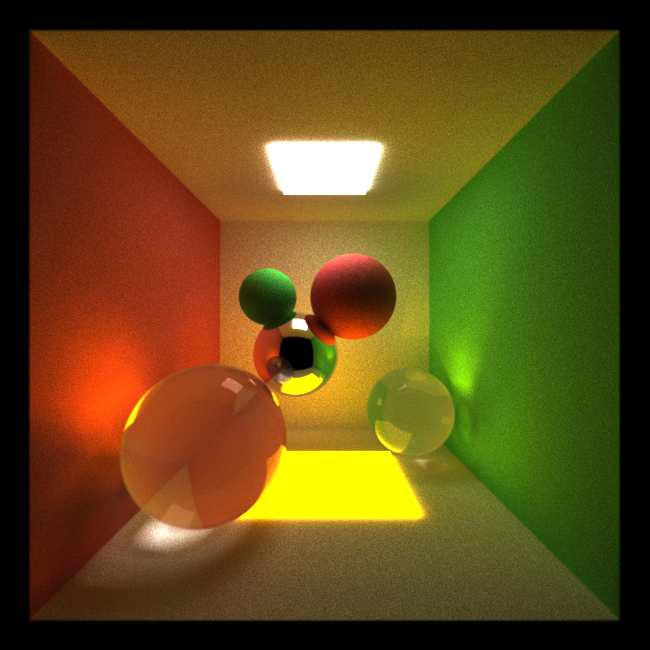

CUDA Path Tracer
================

**University of Pennsylvania, CIS 565: GPU Programming and Architecture, Project 3** 

* Xiang Deng
* Tested on:  Windows 10-Home, i7-6700U @ 2.6GHz 16GB, GTX 1060 6GB (Personal Computer)

**Project Description:**

We assemble multiple colorful objects with diffuse surfaces, perfectly specular surfaces or refraction materials into one scene, after 'turning on' the lights which bounces and hits the objects wihtin the scene,
a beautifully illuminated image is generated.
In this project, we typically explores the development of two major components: 1. run the simulation of ray tracer with CUDA as efficient as possible 2. generate cool images with splendid visual effects.

 Static scene rendering + basic shading features (reflection + diffusion + refraction)
 
   |   |  
  
 
 
* Features
  * BSDF shading with diffusion, reflection.
  * Stream Compaction for removing inactive rays.
  * Sorting rays by material id.
  * First bounce caching of intersections.

* Additional features
  * Work efficient shared memory compaction.
  * Refractions.
  * Anti-aliasing with uniform guassian spherical jitter.
  * Motion blur.
  * Depth of field. 

Some demos we had so far: 
  
Motion blur + basic shading features (reflection + diffusion + refraction) |  Screen Shot of Motion Blur From a Differnt Angle |
:-------------------------:|:-------------------------: 
  | 

Depth of field with DoFx=2, DoFy=10 |Depth of field DoFx=5, DoFy=5
:-------------------------:|:-------------------------:
 | 

 Anti-aliasing |  Without-anti-aliasing
 :-------------------------:|:-------------------------: 
 | 

**Summary of Implementations (forgive my brevity)**

* The motion blur is essentially produced by adding Gaussian noise to time sampling of the object movements seen by the camera (technically the rays that hits the moving sphere); initial speed of objects can be set in the 
scene file (cornellMove.txt for example); different inital speed setting can cause differnt blur effects.

* The refraction is essentially following the Schlick's approximation (https://en.wikipedia.org/wiki/Schlick%27s_approximation). Lights can either be reflected by the surface or  enter and bounces
inside the ball, or come out again.

* Depth of field is typically based on PBRT chap 6 and chap 13, especially including the concentric disc sampling (chap 13).

* Anti-aliasing is achieved by adding uniform spherical Gaussian noises with radius of 0.005 to each rays from the camera, resource can be found here http://paulbourke.net/miscellaneous/aliasing/.

In addition, regarding optimization, a few methods were implemented, including work efficient shared memory stream compaction, organizing rays contiguous in memory by sorting, caching first bounces of ray intersections, etc.
 

# Analysis

Stream Compaction reduces the number of active bouncing paths within one iteration, plot below illustrates this in open scene (cornell).
The thrust implementation (removeif) performs similar to the work effcicient shared memory version implementated by the author.

Stream compaction consequently significantly reduces the time consumption on computing spatial intersections of rays on objects; yet overhead of the extra
time spending on compaction itself trememdously decreases its benefit.
In comparison between the two version of compaction, shared memory provides more benefits in terms of both computing intersections and the overall CUDA running time.

In closed scene, Stream Compaction doesn't significantly the number of active bouncing paths within one iteration, plot below illustrates this in closed scene (cornell), in this case very few
rays terminated.
The thrust implementation (removeif) performs similar to the work effcicient shared memory version implementated by the author.

In closed scene, both implementation of compaction causes delay in processing; yet the overhead of the extra
time spending on compaction itself cause further delay. Lights terminated mostly (probably) due to the collision on emissive lights.
In comparison between the two version of compaction, shared memory provides more benefits in terms of both computing intersections and the overall CUDA running time.

Sorting trememdously increases the delay in processing; whereas caching first bouncing does reduces around 10 percent of the total processing time.
However, caching does has its limitations since it's assuming the scene is static, if objects are moving, caching the first bounce intersections might causes laggy rendering.
Sorting turns out to have more overhead effects than any other optimization methods so far. It doesn't have the benefit in either open or closed scene: in open scene it is more wise to remove 
terminated rays as soon as possible, making rays contiguous by sorting is not worthwhile considering its complexity and cost; in closed scene it's not likely to have a number of rays terminated,
in such case the memory isn't as sparse as open scene while sorting and making memory contiguous might not be useful in this case either.

# CMakeLists Changes

A couple changed were made, 1. Changed CUDA compatiblity sm_20 --> sm_61; 2. Added file names from stream compaction folder; 3. Adjustments of main cmakelist file 
for fixing linking errors with Visual Studio 2013, CUDA 8 (see https://groups.google.com/forum/#!topic/cis-565-fall-2016/kMSmwhhdqFg , also includes the changes to the 
external folder).

* Togglable parameters of modes, please see common.h.
* Parameters for motion speed, camera DOF, etc, please see cornellMove.txt for reference.

# References

* [PBRT] Physically Based Rendering, Second Edition: From Theory To Implementation. Pharr, Matt and Humphreys, Greg. 2010.
* Antialiasing and Raytracing. Chris Cooksey and Paul Bourke, http://paulbourke.net/miscellaneous/aliasing/
* [Sampling notes](http://graphics.ucsd.edu/courses/cse168_s14/) from Steve Rotenberg and Matteo Mannino, University of California, San Diego, CSE168: Rendering Algorithms