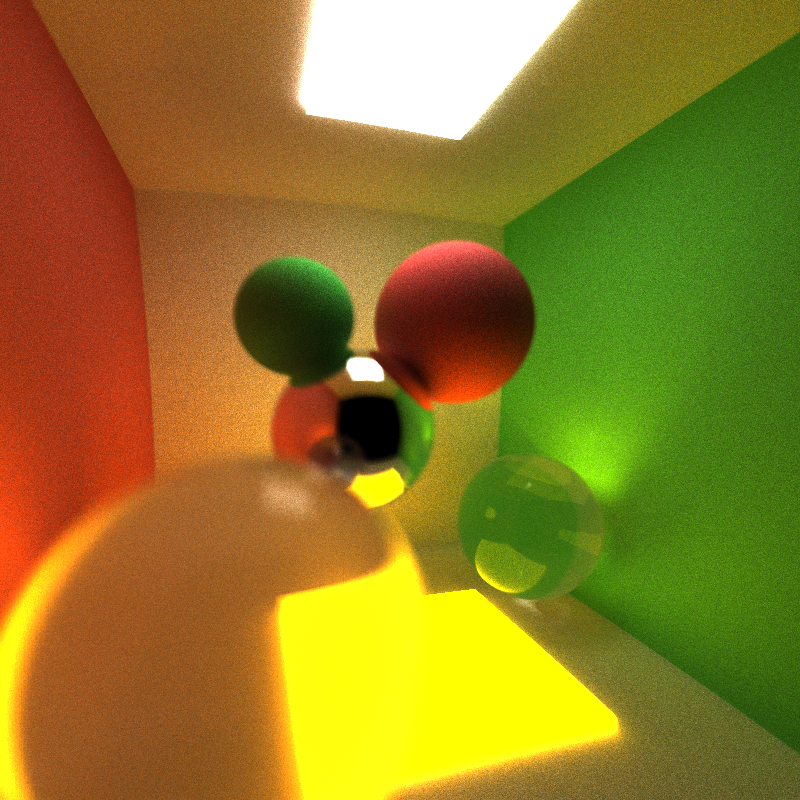
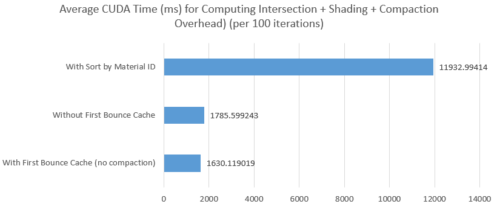

CUDA Path Tracer
================

**University of Pennsylvania, CIS 565: GPU Programming and Architecture, Project 3**

* (TODO) YOUR NAME HERE
* Tested on: (TODO) Windows 22, i7-2222 @ 2.22GHz 22GB, GTX 222 222MB (Moore 2222 Lab)

### (TODO: Your README)

*DO NOT* leave the README to the last minute! It is a crucial part of the
project, and we will not be able to grade you without a good README.

* Analysis

Stream Compaction reduces the number of active bouncing paths within one iteration, plot below illustrates this in open scene (cornell).
The thrust implementation (removeif) performs similar to the work effcicient shared memory version implementated by the author.

Stream compaction consequently significantly reduces the time consumption on computing spatial intersections of rays on objects; yet overhead of the extra
time spending on compaction itself trememdously decreases its benefit.

In closed scene, Stream Compaction doesn't significantly the number of active bouncing paths within one iteration, plot below illustrates this in closed scene (cornell), in this case very few
rays terminated.
The thrust implementation (removeif) performs similar to the work effcicient shared memory version implementated by the author.

In closed scene, both implementation of compaction causes delay in processing; yet the overhead of the extra
time spending on compaction itself cause further delay. Lights terminated mostly (probably) due to the collision on emissive lights.

Sorting trememdously increases the delay in processing; whereas caching first bouncing does reduces around 10 percent of the total processing time.

